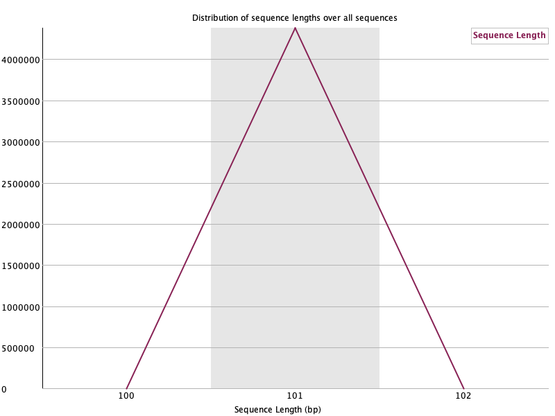

# VEME 2024 NGS Variant Calling Tutorial

[](https://gitpod.io/#https://github.com/taylorpaisie/VEME_2024_NGS_Variant_Calling)

<figure>
    
</figure>

## Taylor K. Paisie
### CDC - Bacterial Special Pathogens Branch (BSPB)
### Email:  ltj8@cdc.gov

### Tutorial link:  
### `https://taylorpaisie.github.io/VEME_2024_NGS_Variant_Calling/`


#### Directory visualization
<figure>
    
    <figcaption>Structure of the directories for the variant calling tutorial</figcaption>
</figure>

#### Command line cheat sheet
<figure>
    
    <figcaption>Variant Calling Workflow</figcaption>
</figure>

### 1. Background and Metadata
#### What is Variant (or SNP) Calling?
#### Variant calling is the process of identifying and cataloging the differences between the observed sequencing reads and a reference genome
#### Variants are usually determined from alignments or BAM files Typical variant calling process:
1. Align reads to the reference genome
2. Correct and refine alignments
3. Determine variants from the alignments
4. Filter the resulting variants for the desired characteristics

<figure>
    
    <figcaption>Variant Calling Workflow</figcaption>
</figure>

#### In the variant calling process you will run into terminologies that are not always used consistently
#### We will attempt to define a few of these terms while making a note that these definitions are not “textbook” definitions designed to accurately capture the proper terminology
### 2. Assessing Read Quality

	
1. Downloading SRA files:  
    * Make a directory to download fastq files:  
    `$ mkdir -p ~/variant_calling/data/untrimmed_fastq`  
    `$ cd ~/variant_calling/data/untrimmed_fastq`
    * Download fastq files:  
	`$ curl -O ftp://ftp.sra.ebi.ac.uk/vol1/fastq/SRR197/007/SRR1972917/SRR1972917_1.fastq.gz`   
	`$ curl -O ftp://ftp.sra.ebi.ac.uk/vol1/fastq/SRR197/007/SRR1972917/SRR1972917_2.fastq.gz`  
	`$ curl -O ftp://ftp.sra.ebi.ac.uk/vol1/fastq/SRR197/008/SRR1972918/SRR1972918_1.fastq.gz`  
	`$ curl -O ftp://ftp.sra.ebi.ac.uk/vol1/fastq/SRR197/008/SRR1972918/SRR1972918_2.fastq.gz`  
	`$ curl -O ftp://ftp.sra.ebi.ac.uk/vol1/fastq/SRR197/009/SRR1972919/SRR1972919_1.fastq.gz`  
	`$ curl -O ftp://ftp.sra.ebi.ac.uk/vol1/fastq/SRR197/009/SRR1972919/SRR1972919_2.fastq.gz`  
	`$ curl -O ftp://ftp.sra.ebi.ac.uk/vol1/fastq/SRR197/000/SRR1972920/SRR1972920_1.fastq.gz`  
	`$ curl -O ftp://ftp.sra.ebi.ac.uk/vol1/fastq/SRR197/000/SRR1972920/SRR1972920_2.fastq.gz`  
	
2. Let's take a look at one of our fastq files:
	* In order to view our the fastq file, we must decompress it:  
		`$ gunzip SRR1972917_1.fastq.gz`
	* We can view the first complete read in one of the files our dataset by using head to look at the first four lines:  
		`$ head -n 4 SRR1972917_1.fastq`   
    
        * A FASTA-like header, but instead of the > symbol it uses the @ symbol. This is followed by an ID and more optional text, similar to the FASTA headers  
        * The second section contains the measured sequence (typically on a single line), but it may be wrapped until the + sign starts the next section  
        * The third section is marked by the + sign and may be optionally followed by the same sequence id and header as the first section
        * The last line encodes the quality values for the sequence in section 2 and must be of the same length as section 2. It should also be wrapped the same way as the section 2

  
```
@SRR1972917.1 1/1
TCCGTGGGGCTGGTACGACAGTATCGATGAGGGTGGACGCTTCAAGGTCAAGCGTATACAGGTCAACCCCAAAGCTAGCCTGAGCCTTCAGAAACACCACC  
+  
@CCFDDFFHGHHHGIJJIIJJJJGJJJJGIJIJJFIJJJIIJJJJHHFHHFFFFAADEFEDDDDDDDDDDDD??CCCDDDDDDCCCDDCCCDD:?CABDDB
``` 


   * Each quality score represents the probability that the corresponding nucleotide call is incorrect  
   * This quality score is logarithmically based, so a quality score of 10 reflects a base call accuracy of 90%, but a quality score of 20 reflects a base call accuracy of 99%
   * These probability values are the results from the base calling algorithm and depend on how much signal was captured for the base incorporation  


```
Quality encoding: !"#$%&'()*+,-./0123456789:;<=>?@ABCDEFGHIJ
             |         |         |         |         |  
Quality score: 01........11........21........31........41
```

* Compress Fastq file again:  

`$ gzip SRR1972917_1.fastq`  

1. Assessing read quality using FastQC
    * FastQC has a number of features which can give you a quick impression of any problems your data may have, so you can take these issues into consideration before moving forward with your analyses   
    * Rather than looking at quality scores for each individual read, FastQC looks at quality collectively across all reads within a sample  
    * The x-axis displays the base position in the read, and the y-axis shows quality scores  
    * For each position, there is a box-and-whisker plot showing the distribution of quality scores for all reads at that position  
    * The horizontal red line indicates the median quality score and the yellow box shows the 1st to 3rd quartile range  
    * This means that 50% of reads have a quality score that falls within the range of the yellow box at that position  
    * The whiskers show the absolute range, which covers the lowest (0th quartile) to highest (4th quartile) values  
    *The plot background is also color-coded to identify good (green), acceptable (yellow), and bad (red) quality scores  


    `$ fastqc -h`  
    `$ fastqc *.fastq*`  

    * Output should look like this:  
```
application/gzip   
    Started analysis of SRR1972917_1.fastq.gz  
    Approx 5% complete for SRR1972917_1.fastq.gz  
    Approx 10% complete for SRR1972917_1.fastq.gz  
    Approx 15% complete for SRR1972917_1.fastq.gz  
    Approx 20% complete for SRR1972917_1.fastq.gz  
    Approx 25% complete for SRR1972917_1.fastq.gz  
    Approx 30% complete for SRR1972917_1.fastq.gz  
    Approx 35% complete for SRR1972917_1.fastq.gz  
    Approx 40% complete for SRR1972917_1.fastq.gz  
    Approx 45% complete for SRR1972917_1.fastq.gz  
    Approx 50% complete for SRR1972917_1.fastq.gz  
    Approx 55% complete for SRR1972917_1.fastq.gz  
    Approx 60% complete for SRR1972917_1.fastq.gz  
    Approx 65% complete for SRR1972917_1.fastq.gz  
    Approx 70% complete for SRR1972917_1.fastq.gz  
    Approx 75% complete for SRR1972917_1.fastq.gz  
    Approx 80% complete for SRR1972917_1.fastq.gz  
    Approx 85% complete for SRR1972917_1.fastq.gz  
    Approx 90% complete for SRR1972917_1.fastq.gz  
    Approx 95% complete for SRR1972917_1.fastq.gz  
    Analysis complete for SRR1972917_1.fastq.gz
```

   * Lets now look at the files created by FastQC:  
    `$ ls -al` 

   * For each input FASTQ file, FastQC has created a .zip file and a .html file  
   * The .zip file extension indicates that this is actually a compressed set of multiple output files   
   * The .html file is a stable webpage displaying the summary report for each of our samples  
   * We want to keep our data files and our results files separate, so we will move these output files into a new directory within our results/ directory  
    
`$ cd ~/variant_calling`  
`$ mkdir -p results/fastqc_untrimmed_reads`  
`$ mv ~/variant_calling/data/untrimmed_fastq/*.zip ~/variant_calling/results/fastqc_untrimmed_reads`  
`$ mv ~/variant_calling/data/untrimmed_fastq/*.html ~/variant_calling/results/fastqc_untrimmed_reads`  
`$ cd ~/variant_calling/results/fastqc_untrimmed_reads`  

### We can now open the .html file to view the FastQC results: 


<figure>
    
    <figcaption>FastQC Spotlight Visualization</figcaption>
</figure>

#### Should I be worried about the “stoplight” symbols?

Usually not.

When FastQC runs, it generates “stoplight” icons for each analysis having “pass,” “warning,” and “error” symbols. Most of the time, these symbols are not meaningful. They were developed for only a particular class of samples and library preparation methods and just for certain types of instruments.

Although if most or all your stop-light icons are red, then you probably have a data problem.


<figure>
    
    <figcaption>FastQC output of SRR1972917_1.fastq.gz</figcaption>
</figure>

#### What does the sequence quality visualization tell us?
The simplest way to snapshot the quality of a sequencing run is via a chart that plots the error likelihood at each position averaged over all measurements.

The vertical axis is the FASTQ scores that represent error probabilities:

* 10 corresponds to 10% error (1/10)
* 20 corresponds to 1% error (1/100)
* 30 corresponds to 0.1% error (1/1,000)
* 40 corresponds to one error every 10,000 measurements (1/10,000) that is an error rate of 0.01%

The three-colored bands illustrate the typical labels that we assign to these measures: reliable (30-40, green), less reliable (20-30, yellow) and error-prone (1-20, red). The yellow boxes contain 50% of the data, the whiskers indicate the 75% outliers.


<figure>
    
    <figcaption>Sequence lengths histogram of SRR1972917_1.fastq.gz</figcaption>
</figure>

The sequence length distribution shows how many sequences of each length the data contains. For fixed read length instruments, like the Illumina sequencer, all read lengths are the same. For long read technologies like the PacBio and MinION, the distribution can be a lot more varied.

<figure>
    
    <figcaption>Sequence quality histogram of SRR1972917_1.fastq.gz</figcaption>
</figure>

Another way to visualize data quality is to generate histograms of the average qualities. The horizontal scales are the quality scores; the vertical axis indicates the number of reads of that quality.

### 3. Trimming and Filtering

1. Trimming the bad quality reads from our fastq files
    * In the previous episode, we took a high-level look at the quality of each of our samples using FastQC  
    * We visualized per-base quality graphs showing the distribution of read quality at each base across all reads in a sample and extracted information about which samples fail which quality checks  
    * It is very common to have some quality metrics fail, and this may or may not be a problem for your downstream application  
    * For our variant calling workflow, we will be removing some of the low quality sequences to reduce our false positive rate due to sequencing error  
    * We will use a program called [Trimmomatic](https://github.com/timflutre/trimmomatic) to filter poor quality reads and trim poor quality bases from our samples  

```
$ trimmomatic  
    Usage:  
       PE [-version] [-threads <threads>] [-phred33|-phred64] [-trimlog <trimLogFile>] [-summary <statsSummaryFile>] [-quiet] [-validatePairs] [-basein <inputBase> | <inputFile1> <inputFile2>] [-baseout <outputBase> | <outputFile1P> <outputFile1U> <outputFile2P> <outputFile2U>] <trimmer1>...  
   or:  
       SE [-version] [-threads <threads>] [-phred33|-phred64] [-trimlog <trimLogFile>] [-summary <statsSummaryFile>] [-quiet] <inputFile> <outputFile> <trimmer1>...  
   or:  
       -version 

```


   * This output shows us that we must first specify whether we have paired end (PE) or single end (SE) reads  
   * Next, we specify what flag we would like to run. For example, you can specify threads to indicate the number of processors on your computer that you want Trimmomatic to use  
   * In most cases using multiple threads (processors) can help to run the trimming faster  
   * These flags are not necessary, but they can give you more control over the command  
   * The flags are followed by positional arguments, meaning the order in which you specify them is important  
   * In paired end mode, Trimmomatic expects the two input files, and then the names of the output files  
   * While, in single end mode, Trimmomatic will expect 1 file as input, after which you can enter the optional settings and lastly the name of the output file  

   * Trimmomatic command options:  
     * ILLUMINACLIP: Cut adapter and other Illumina-specific sequences from the read  
     * SLIDINGWINDOW: Perform a sliding window trimming, cutting once the average
  quality within the window falls below a threshold  
     * LEADING: Cut bases off the start of a read, if below a threshold quality  
     * TRAILING: Cut bases off the end of a read, if below a threshold quality  
     * CROP: Cut the read to a specified length  
     * HEADCROP: Cut the specified number of bases from the start of the read 4
     * MINLEN: Drop the read if it is below a specified length  
     * TOPHRED33: Convert quality scores to Phred-33  
     * TOPHRED64: Convert quality scores to Phred-64  

1. Running Trimmomatic:  
   
    * Move to the correct directory with untrimmed fastq files we downloaded:  
    `$ cd ~/variant_calling/data/untrimmed_fastq` 

    * Copy Illumina adapters from Trimmomatic into working directory:  
    `$ cp /home/gitpod/miniconda/envs/variant_calling/share/trimmomatic-0.39-2/adapters/NexteraPE-PE.fa .`  

    * Run Trimmomatic:  

    `$ trimmomatic PE SRR1972917_1.fastq.gz SRR1972917_2.fastq.gz SRR1972917_1.trim.fastq.gz SRR1972917_1un.trim.fastq.gz SRR1972917_2.trim.fastq.gz SRR1972917_2un.trim.fastq.gz SLIDINGWINDOW:4:20 MINLEN:25 ILLUMINACLIP:NexteraPE-PE.fa:2:40:15`  
    
    * Output:  

    ```
    TrimmomaticPE: Started with arguments:
    SRR1972917_1.fastq.gz SRR1972917_2.fastq.gz SRR1972917_1.trim.fastq.gz SRR1972917_1un.trim.fastq.gz SRR1972917_2.trim.fastq.gz SRR1972917_2un.trim.fastq.gz SLIDINGWINDOW:4:20 MINLEN:25 ILLUMINACLIP:NexteraPE-PE.fa:2:40:15
    Multiple cores found: Using 4 threads
    Using PrefixPair: 'AGATGTGTATAAGAGACAG' and 'AGATGTGTATAAGAGACAG'
    Using Long Clipping Sequence: 'GTCTCGTGGGCTCGGAGATGTGTATAAGAGACAG'
    Using Long Clipping Sequence: 'TCGTCGGCAGCGTCAGATGTGTATAAGAGACAG'
    Using Long Clipping Sequence: 'CTGTCTCTTATACACATCTCCGAGCCCACGAGAC'
    Using Long Clipping Sequence: 'CTGTCTCTTATACACATCTGACGCTGCCGACGA'
    ILLUMINACLIP: Using 1 prefix pairs, 4 forward/reverse sequences, 0 forward only sequences, 0 reverse only sequences
    Quality encoding detected as phred33
    Input Read Pairs: 4377867 Both Surviving: 1241328 (28.35%) Forward Only Surviving: 2133670 (48.74%) Reverse Only Surviving: 18680 (0.43%) Dropped: 984189 (22.48%)
    TrimmomaticPE: Completed successfully

    ```


   * List out files created by Trimmomatic:  
    `$ ls SRR1972917*`  

   * Trimmed files should be smaller in size than our untrimmed fastq files
  
2. Running a for loop on all fastq files  

```
$ for infile in *_1.fastq.gz
    do
        base=$(basename ${infile} _1.fastq.gz)
        trimmomatic PE ${infile} ${base}_2.fastq.gz \
        ${base}_1.trim.fastq.gz ${base}_1un.trim.fastq.gz \
        ${base}_2.trim.fastq.gz ${base}_2un.trim.fastq.gz \
        SLIDINGWINDOW:4:20 MINLEN:25 ILLUMINACLIP:NexteraPE-PE.fa:2:40:15
    done
```


3. Moving trimmed fastq files to a new directory:
    * We have now completed the trimming and filtering steps of our quality control process! Before we move on, let’s move our trimmed FASTQ files to a new subdirectory within our data/ directory  
  
    `$ cd ~/variant_calling/data/untrimmed_fastq`  
    `$ mkdir -p ~/variant_calling/data/trimmed_fastq`  
    `$ mv *trim* ~/variant_calling/data/trimmed_fastq`  
    `$ cd ~/variant_calling/data/trimmed_fastq`  
    `$ ls -al`  

4. Lets rerun FastQC on the trimmed fastq files  
    `$ fastqc *trim.fastq.gz`


### 4. Reference Based Mapping  

1. Aligning to a reference genome
    * We perform read alignment or mapping to determine where in the genome our reads originated from  
    * There are a number of tools to choose from and, while there is no gold standard, there are some tools that are better suited for particular NGS analyses  
    * We will be using the [Burrows Wheeler Aligner (BWA)](https://github.com/lh3/bwa), which is a software package for mapping low-divergent sequences against a large reference genome  
    * The alignment process consists of two steps:  
        * Indexing the reference genome  
        * Aligning the reads to the reference genome  


2. Downloading reference genome  
   * Navigate to NCBI and search for GenBank accession `KJ660346.2` and download fasta file  

    `$ mkdir -p ~/variant_calling/data/ref_genome`  
    `$ cd ~/variant_calling/data/ref_genome`  
    `$ wget -nv https://raw.githubusercontent.com/taylorpaisie/VEME_2024_NGS_Variant_Calling/main/KJ660346.2.fasta -O KJ660346.2.fasta`  
    

3. Create directories for the results that will be generated as part of this workflow    
    * We can do this in a single line of code, because mkdir can accept multiple new directory names as input  
    `$ cd ~/variant_calling/`  
    `$ mkdir -p results/sam results/bam results/bcf results/vcf`  

4. Index the reference genome  
    * Our first step is to index the reference genome for use by BWA  
    * Indexing allows the aligner to quickly find potential alignment sites for query sequences in a genome, which saves time during alignment  
    * Indexing the reference only has to be run once  
    * The only reason you would want to create a new index is if you are working with a different reference genome or you are using a different tool for alignment  
    `$ bwa index data/ref_genome/KJ660346.2.fasta`  

5. Align reads to the reference genome  
    * The alignment process consists of choosing an appropriate reference genome to map our reads against and then deciding on an aligner  
    * We will use the BWA-MEM algorithm, which is the latest and is generally recommended for high-quality queries as it is faster and more accurate  
    `$ bwa mem data/ref_genome/KJ660346.2.fasta data/trimmed_fastq/SRR1972917_1.trim.fastq.gz data/trimmed_fastq/SRR1972917_2.trim.fastq.gz > results/sam/SRR1972917.aligned.sam`  

    * The SAM file, is a tab-delimited text file that contains information for each individual read and its alignment to the genome  
    * The compressed binary version of SAM is called a BAM file  
    * We use this version to reduce size and to allow for indexing, which enables efficient random access of the data contained within the file  
    * The file begins with a header, which is optional  
    * The header is used to describe the source of data, reference sequence, method of alignment, etc., this will change depending on the aligner being used  
    * Following the header is the alignment section  
    * Each line that follows corresponds to alignment information for a single read  
    * Each alignment line has 11 mandatory fields for essential mapping information and a variable number of other fields for aligner specific information  
    * An example entry from a SAM file is displayed below with the different fields highlighted  
    * We will use the program [samtools](https://www.htslib.org/) for these steps
  
6. Convert SAM file to BAM format  
    `$ samtools view -S -b results/sam/SRR1972917.aligned.sam > results/bam/SRR1972917.aligned.bam`  

7. Sort BAM file by coordinates  
    `$ samtools sort -o results/bam/SRR1972917.aligned.sorted.bam results/bam/SRR1972917.aligned.bam`   

    * Lets take a look at the statistics in our BAM file:  
    `$ samtools flagstat results/bam/SRR1972917.aligned.sorted.bam`  

Now lets view the header of our BAM file:  

`$ samtools view -H results/bam/SRR1972917.aligned.sorted.bam`

```
@HD	VN:1.5	SO:coordinate
@SQ	SN:KJ660346.2	LN:18959
@PG	ID:bwa	PN:bwa	VN:0.7.18-r1243-dirty	CL:bwa mem /Users/tpaisie/variant_calling/data/ref_genome/KJ660346.2.fasta /Users/tpaisie/variant_calling/data/trimmed_fastq/SRR1972917_1.trim.fastq.gz /Users/tpaisie/variant_calling/data/trimmed_fastq/SRR1972917_2.trim.fastq.gz
@PG	ID:samtools	PN:samtools	PP:bwa	VN:1.20	CL:samtools view -S -b /Users/tpaisie/variant_calling/results/sam/SRR1972917.aligned.sam
@PG	ID:samtools.1	PN:samtools	PP:samtools	VN:1.20	CL:samtools sort -o /Users/tpaisie/variant_calling/results/bam/SRR1972917.aligned.sorted.bam /Users/tpaisie/variant_calling/results/bam/SRR1972917.aligned.bam
@PG	ID:samtools.2	PN:samtools	PP:samtools.1	VN:1.20	CL:samtools view -H results/bam/SRR1972917.aligned.sorted.bam
```

    
Now lets view a small part of our BAM file:  

`$ samtools view results/bam/SRR1972917.aligned.sorted.bam | head -1` 


Mapping Quality (MAPQ) and Compact Idiosyncratic Gapped Alignment Representation (CIGAR):

`$ samtools view results/bam/SRR1972917.aligned.sorted.bam | cut -f 5,6 | grep -v "101" | head -5`

```
60	32M
60	33M
49	31M
60	2S98M
60	3S98M
```

The values in the MAPQ (Mapping Quality) column here are all 60. This column was designed to indicate the likelihood of the alignment being placed incorrectly. It is the same Phred score that we encountered in the FASTQ files. And we read it the same way, 60/10 = 6 so the chance of seeing this alignment being wrong is 10^-6 or 1/1,000,000 one in a million.

The numbers that an aligner puts into the MAPQ field are typically estimates. It is not possible to mathematically compute this value. What this field does is to inform us on a guess by the aligner’s algorithm. This guess is more of a hunch that should not be treated as a continuous, numerical value. Instead, it should be thought of as an ordered label, like “not so good” or “pretty good”. Aligner developers even generate unique MAPQ qualities to mark individual cases. For example, bwa will create a MAPQ=0 if a read maps equally well to more than one location.

The CIGAR string is a different beast altogether. It is meant to represent the alignment via numbers followed by letters:

- `M` match of mismatch
- `I` insertion
- `D` deletion
- `S` soft clip
- `H` hard clip
- `N` skipping

These are also meant to be “readable”; the 2S98M says that 2 bases are soft clipped and the next 98 are a match or mismatch.

The CIGAR representation is a neat concept, alas it was developed for short and well-matching reads. As soon as the reads show substantial differences the CIGAR representations are much more difficult to read.

There are also different variants of CIGAR. The “default” CIGAR encoding describes both the match and mismatch in the same way, with an M. There are some unfortunate rationales and explanations for having adopted this choice - one that complicates analysis even more.

The extended CIGAR encoding adopted by others uses the symbols of = and X to indicate matches and mismatches.


### 5. Variant Calling

#### A variant call is a conclusion that there is a nucleotide difference vs. some reference at a given position in an individual genome or transcriptome, often referred to as a Single Nucleotide Variant (SNV)  
#### The call is usually accompanied by an estimate of variant frequency and some measure of confidence  
#### Similar to other steps in this workflow, there are a number of tools available for variant calling  
#### We will be using [bcftools](https://samtools.github.io/bcftools/bcftools.html), but there are a few things we need to do before actually calling the variants  

1. Calculate the read coverage of positions in the genome  
   `$ bcftools mpileup -O b -o results/bcf/SRR1972917_raw.bcf -f data/ref_genome/KJ660346.2.fasta results/bam/SRR1972917.aligned.sorted.bam `  

2. Detect the single nucleotide variants (SNVs)  
    * Identify SNVs using bcftools call. We have to specify ploidy with the flag `--ploidy`, which is one for our Ebola genome. `-m` allows for multiallelic and rare-variant calling, `-v` tells the program to output variant sites only (not every site in the genome), and `-o` specifies where to write the output file:  
    `$ bcftools call --ploidy 1 -m -v -o results/vcf/SRR1972917_variants.vcf results/bcf/SRR1972917_raw.bcf`   

3. Filter and report the SNV variants in variant calling format (VCF)
    * Filter the SNVs for the final output in VCF format, using vcfutils.pl:  
    `$ vcfutils.pl varFilter results/vcf/SRR1972917_variants.vcf  > results/vcf/SRR1972917_final_variants.vcf`  

4. Explore the VCF format:  
    `$ less -S results/vcf/SRR1972917_final_variants.vcf` 

    Or you can use the `code` command to open the vcf file with VS code:  
    `$ code results/vcf/SRR1972917_final_variants.vcf`   

    * You will see the header (which describes the format), the time and date the file was created, the version of bcftools that was used, the command line parameters used, and some additional information  
    * The first few columns represent the information we have about a predicted variation:  
<figure>
    
</figure>

   * The last two columns contain the genotypes and can be tricky to decode:  
<figure>
    
</figure>

   * For our file, the metrics presented are GT:PL:GQ:  
<figure>
    
</figure>


### 6. Visualizing the Results
#### It is often instructive to look at your data in a genome browser  
#### Visualization will allow you to get a “feel” for the data, as well as detecting abnormalities and problems  
#### Also, exploring the data in such a way may give you ideas for further analyses  
#### As such, visualization tools are useful for exploratory analysis  
#### We will describe two different tools for visualization: a light-weight command-line based one and the Broad Institute’s [Integrative Genomics Viewer (IGV)](https://igv.org/doc/desktop/#) which requires software installation and transfer of files

1. In order for us to visualize the alignment files, we will need to index the BAM file using samtools:  
    `$ samtools index results/bam/SRR1972917.aligned.sorted.bam`  
2. Viewing with `tview`
    * In order to visualize our mapped reads, we use tview, giving it the sorted bam file and the reference file:  
    `$ samtools tview results/bam/SRR1972917.aligned.sorted.bam data/ref_genome/KJ660346.2.fasta`  

    * The first line of output shows the genome coordinates in our reference genome. The second line shows the reference genome sequence  
    * The third line shows the consensus sequence determined from the sequence reads. 
    * A `.` indicates a match to the reference sequence, so we can see that the consensus from our sample matches the reference in most locations   
    * If that was not the case, we should probably reconsider our choice of reference  
    * Below the horizontal line, we can see all of the reads in our sample aligned with the reference genome  
    * Only positions where the called base differs from the reference are shown  
    * You can use the arrow keys on your keyboard to scroll or type `?` for a help menu   
    * To navigate to a specific position, type `g`  
    * A dialogue box will appear  
    * In this box, type the name of the “chromosome” followed by a colon and the position of the variant you would like to view (e.g. for this sample, type CP000819.1:50 to view the 50th base. Type `Ctrl^C` or `q` to exit tview  
  
3. Viewing with IGV
    #### IGV is a stand-alone browser, which has the advantage of being installed locally and providing fast access. Web-based genome browsers, like Ensembl or the UCSC browser, are slower, but provide more functionality  
    #### They not only allow for more polished and flexible visualization, but also provide easy access to a wealth of annotations and external data sources  
    #### This makes it straightforward to relate your data with information about repeat regions, known genes, epigenetic features or areas of cross-species conservation, to name just a few   
  
    1. Open IGV  
    2. Load our reference genome file (KJ660346.2.fasta) into IGV using the “Load Genomes from File…” option under the “Genomes” pull-down menu  
    3. Load our BAM file (SRR1972917.aligned.sorted.bam) using the “Load from File…” option under the “File” pull-down menu  
    4. Do the same with our VCF file (SRR1972917_final_variants.vcf)  

    <figure>
    
    </figure>


    * There should be two tracks: one coresponding to our BAM file and the other for our VCF file  
    * In the VCF track, each bar across the top of the plot shows the allele fraction for a single locus  
    * The second bar shows the genotypes for each locus in each sample  
    * We only have one sample called here, so we only see a single line  
    * Dark blue = heterozygous, Cyan = homozygous variant, Grey = reference  
    * Filtered entries are transparent  
    * Zoom in to inspect variants you see in your filtered VCF file to become more familiar with IGV  
    * See how quality information corresponds to alignment information at those loci  


### 7. Automating a Variant Calling Workflow

#### You wrote a simple shell script eariler in this tutorial
#### Shell scripts can be much more complicated than that and can be used to perform a large number of operations on one or many files  
#### This saves you the effort of having to type each of those commands over for each of your data files and makes your work less error-prone and more reproducible  
#### For example, the variant calling workflow we just carried out had about eight steps where we had to type a command into our terminal   
#### If we wanted to do this for all eight of our data files, that would be forty-eight steps  
#### If we had 50 samples, it would be 400 steps
#### We have also used for loops earlier to iterate one or two commands over multiple input files  
#### In these for loops, the filename was defined as a variable in the for statement, which enables you to run the loop on multiple files  


#### Running Trimmomatic on all samples:

```
$ for infile in *_1.fastq.gz
    do
        base=$(basename ${infile} _1.fastq.gz)  
        trimmomatic PE ${infile} ${base}_2.fastq.gz  
        ${base}_1.trim.fastq.gz ${base}_1un.trim.fastq.gz  
        ${base}_2.trim.fastq.gz ${base}_2un.trim.fastq.gz  
        SLIDINGWINDOW:4:20 MINLEN:25 ILLUMINACLIP:NexteraPE-PE.fa:2:40:15   
    done
``` 

* Within the Bash shell you can create variables at any time (as we did above, and during the `for` loop lesson)  
* Assign any name and the value using the assignment operator: `=`  
* You can check the current definition of your variable by typing into your script: echo `$variable_name`  

#### Notice that in this for loop, we used two variables, `infile`, which was defined in the for statement, and `base`, which was created from the filename during each iteration of the loop  

#### We can extend these principles to the entire variant calling workflow. 
#### To do this, we will take all of the individual commands that we wrote before, put them into a single file, add variables so that the script knows to iterate through our input files and write to the appropriate output files

#### Make a directory for automated variant calling script:

`$ mkdir scripts`  
`$ cd scripts/`  
`$ touch run_variant_calling.sh`  

Instead of using the `touch` command you can use `code` to open in VS code:  

`$ code run_variant_calling.sh`


#### Our variant calling workflow has the following steps:  
1. Index the reference genome for use by bwa and samtools  
2. Align reads to reference genome  
3. Convert the format of the alignment to sorted BAM, with some intermediate steps  
4. Calculate the read coverage of positions in the genome  
5. Detect the SNVs  
6. Filter and report the SNVs in VCF  


#### Let's write our script, which should look like this:  

```
#! bin/bash/

set -e
cd ~/variant_calling/results

genome=~/variant_calling/data/ref_genome/KJ660346.2.fasta

bwa index $genome

# makes directories (should already be made)
# mkdir -p sam bam bcf vcf

for fq1 in ~/variant_calling/data/trimmed_fastq/*_1.trim.fastq.gz
    do
    echo "working with file $fq1"

    base=$(basename $fq1 _1.trim.fastq.gz)
    echo "base name is $base"

    fq1=~/variant_calling/data/trimmed_fastq/${base}_1.trim.fastq.gz
    fq2=~/variant_calling/data/trimmed_fastq/${base}_2.trim.fastq.gz
    sam=~/variant_calling/results/sam/${base}.aligned.sam
    bam=~/variant_calling/results/bam/${base}.aligned.bam
    sorted_bam=~/variant_calling/results/bam/${base}.aligned.sorted.bam
    raw_bcf=~/variant_calling/results/bcf/${base}_raw.bcf
    variants=~/variant_calling/results/vcf/${base}_variants.vcf
    final_variants=~/variant_calling/results/vcf/${base}_final_variants.vcf 

    bwa mem $genome $fq1 $fq2 > $sam
    samtools view -S -b $sam > $bam
    samtools sort -o $sorted_bam $bam 
    samtools index $sorted_bam
    bcftools mpileup -O b -o $raw_bcf -f $genome $sorted_bam
    bcftools call --ploidy 1 -m -v -o $variants $raw_bcf 
    vcfutils.pl varFilter $variants > $final_variants
   
    done
```
 

#### We change our working directory so that we can create new results subdirectories in the right location  

`$ cd ~/variant_calling/results`   

#### Next we tell our script where to find the reference genome by assigning the genome variable to the path to our reference genome:  

`$ genome=~/variant_calling/data/ref_genome/KJ660346.2.fasta`  

#### Now we want to index the reference genome for BWA:

`$ bwa index $genome`  

#### We already have all the directories in `results` that are needed


#### What is in our automated variant calling script?
* We will use a loop to run the variant calling workflow on each of our FASTQ files   
* The full list of commands within the loop will be executed once for each of the FASTQ files in the data/trimmed_fastq/ directory   
* We will include a few echo statements to give us status updates on our progress  
* The first thing we do is assign the name of the FASTQ file we are currently working with to a variable called fq1 and tell the script to echo the filename back to us so we can check which file we are on  

```
for fq1 in ~/variant_calling/data/trimmed_fastq/*_1.trim.fastq.gz
    do
    echo "working with file $fq1"
```  

* We then extract the base name of the file (excluding the path and .fastq.gz extension) and assign it to a new variable called base  

```
    base=$(basename $fq1 _1.trim.fastq.gz)
    echo "base name is $base"
```

* We can use the base variable to access both the base_1.fastq.gz and base_2.fastq.gz input files, and create variables to store the names of our output files   
* This makes the script easier to read because we do not need to type out the full name of each of the files: instead, we use the base variable, but add a different extension (e.g. .sam, .bam) for each file produced by our workflow  

```
    .# input fastq files
    fq1=~/variant_calling/data/trimmed_fastq/${base}_1.trim.fastq.gz
    fq2=~/variant_calling/data/trimmed_fastq/${base}_2.trim.fastq.gz
        
    # output files
    sam=~/variant_calling/results/sam/${base}.aligned.sam
    bam=~/variant_calling/results/bam/${base}.aligned.bam
    sorted_bam=~/variant_calling/results/bam/${base}.aligned.sorted.bam
    raw_bcf=~/variant_calling/results/bcf/${base}_raw.bcf
    variants=~/variant_calling/results/vcf/${base}_variants.vcf
    final_variants=~/variant_calling/results/vcf/${base}_final_variants.vcf   
```

#### Now to the actual steps of the workflow:

1. Align the reads to the reference genome and output a .sam file:

`$ bwa mem $genome $fq1 $fq2 > $sam`  

2. Convert the SAM file to BAM format:  

`$ samtools view -S -b $sam > $bam`  

3. Sort the BAM file:  

`$ samtools sort -o $sorted_bam $bam`  

4. Index the BAM file for display purposes:  

`$ samtools index $sorted_bam`  

5. Calculate the read coverage of positions in the genome:  

`$ bcftools mpileup -O b -o $raw_bcf -f $genome $sorted_bam`  

6. Call SNVs with bcftools:  

`$ bcftools call --ploidy 1 -m -v -o $variants $raw_bcf`  

7. Filter and report the SNVs in a VCF:  

`$ vcfutils.pl varFilter $variants > $final_variants`  


#### Time to run the script!

`$ bash run_variant_calling.sh`  

#### Now your automated variant calling script should be running!!!
#### Tip:  using echo statements within your scripts is a great way to get an automated progress update
